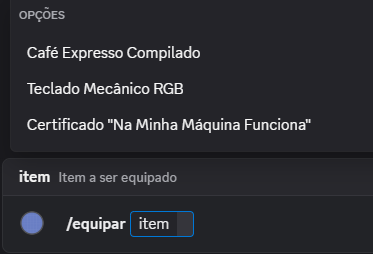
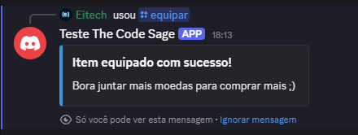

# Comando /equipar

## Resumo
- Nome do comando: `/equipar`
- Cog/Arquivo: `src/cogs/user_cog.py`
- Para quem é: Usuário final que quer equipar um item do inventário
- Resultado: O usuário equipa o item selecionado.

## Parâmetros
- `interaction` (discord.Interaction) — usuário da interação atual
- `item` (int) — ID do item selecionado via autocomplete.

## Comportamento
- Busca dados dos itens dísponiveis no inventário
- Recebe o ID do item selecionado via autocomplete(limite máximo de 25 sugestões).
- Monta um Embed e envia no followup.
- Defer da resposta como ephemeral (visível só ao usuário).

## Fluxo interno
1. Recebe a interação do Discord.
2. Chama `UserService.equip_item(user_id, item_id)`.
3. Monta Embed/View de sucesso ou de erro caso falhe.

## Trecho de código essencial
```python
    async def equip_autocomplete(self, interaction: discord.Interaction, current: str) -> List[
        app_commands.Choice[str]]:
        user_id = interaction.user.id

        _, _, items = await self.user_service.get_user_inventory(user_id)

        if not items:
            return []

        suggestions =[]


        for item in items:
            if current.lower() in item['name'].lower():
                suggestions.append(
                    app_commands.Choice(name=item['name'], value=str(item['id']))
                )

        return suggestions[:25]

    @app_commands.command(name='equipar', description='Equipa um item do seu inventário')
    @app_commands.autocomplete(item=equip_autocomplete)
    async def equip_item(self, interaction: discord.Interaction, item: int):
        await interaction.response.defer(ephemeral=True)

        sucess, message = await self.user_service.equip_item(
            user_id=interaction.user.id,
            item_id=item)

        if sucess:
            embed = create_info_embed(title='Item equipado com sucesso!',
                                      message='Bora juntar mais moedas para comprar mais ;)')
        else:
            embed = create_error_embed(title='Falha ao equipar o item', message=message)

        await interaction.followup.send(embed=embed)
```


## Erros e mensagens
- "Falha ao equipar o item." — Quando o serviço falha ao tentar equipar o item.
- "Item equipado com sucesso!" — Quando o serviço obtem sucesso ao equipar o item.

## Exemplos de uso
- Autocomplete até 25 sugestões(Com base nos iten do seu inventário):



- Mensagem de sucesso:




## Referências
- Service relacionado: [UserService](../servicos/user-service.md) 
- Repositórios: [UserRepository](../repositorios/user-repository.md)
- Modelos: [Modelo de comando](../referencias/modelos/comando.md)
